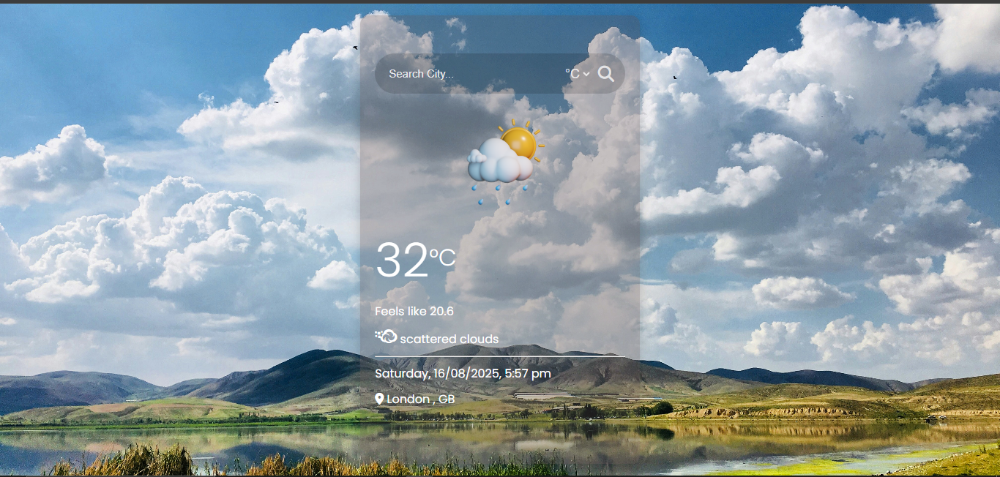
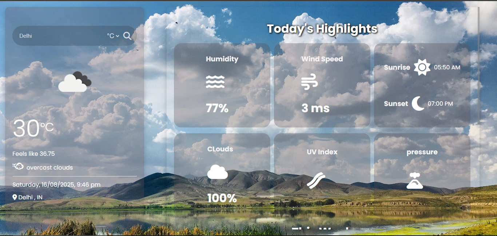

# 🌦️ Weather App  

[](https://shivin1016.github.io/weatherApp/)  

  

A simple and beautiful **Weather Application** that provides real-time weather updates for any location. Built with modern web technologies, it features a responsive design, smooth animations, and accurate weather data.  

---

## ✨ Features  
- 🌍 **Location-based weather detection** (Geolocation API)  
- 🔍 **Search by city name**  
- 🌡️ Displays **temperature** in Celsius/Fahrenheit  
- 💧 Shows **humidity**, **wind speed**, and **condition**  
- ☁️ Dynamic **weather icons** (sunny, cloudy, rainy, etc.)  
- 🎨 Custom **backgrounds & animations** based on weather  

---

## 🛠️ Tech Stack  
- **Frontend:** HTML, CSS, JavaScript  
- **API:** [OpenWeatherMap API](https://openweathermap.org/api)  
- **Styling:** CSS animations  

---

## 📷 Screenshots  
| Home Screen | Search Weather | Location Weather |
|-------------|----------------|------------------|
|  |  |

---


## ⚡ Getting Started  

### 1️⃣ Clone the repository  
```bash
git clone https://github.com/Shivin/weather-app.git
cd weather-app

2️⃣ Add your API Key 
Get a free API key from OpenWeatherMap. 
Create a config.js file in the root folder and add:

3️⃣ Run the app
Open index.html directly in your browser

Or use Live Server in VS Code

folder structure
weather-app/
│── index.html
│── style.css
│── script.js
│── config.js
│── assets/
│    ├── icons/
│    ├── backgrounds/
│    ├── screenshots/
│         ├── home.png
│         ├── output.png 
│── README.md
